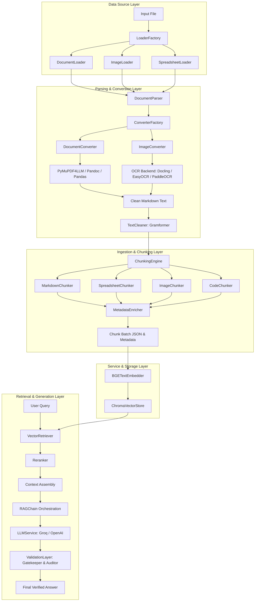

# DocuFlow Architecture Overview

DocuFlow is a production-grade, structure-aware Retrieval-Augmented Generation (RAG) system designed to convert, chunk, enrich, and index multi-format documents (PDF, DOCX, SPREADSHEETS, IMAGES, TXT, MD) into a persistent vector database ([ChromaDB](file:///home/hardik/projects/DocuFlow/chroma)) for semantic querying.

---

## 1. System Layers & Architecture

DocuFlow is architected with clear separation of concerns, strict decoupling using abstract contracts, and production telemetry.

---

## 2. Layer-by-Layer Breakdown

### 2.1. Data Source Layer
Responsible for identifying files, verifying existence, and reading them into standard memory byte buffers.
*   **Key Contract**: [IDatasource](file:///home/hardik/projects/DocuFlow/src/docuflow/interfaces/data_source.py)
*   **Factory**: [LoaderFactory](file:///home/hardik/projects/DocuFlow/src/docuflow/data_source/loader_factory.py) dynamically resolves the loader matching the file extension.
*   **Concrete Loaders**:
    *   [DocumentLoader](file:///home/hardik/projects/DocuFlow/src/docuflow/data_source/document_loader.py): Handles `.pdf`, `.docx`, `.txt`, `.md`.
    *   [ImageLoader](file:///home/hardik/projects/DocuFlow/src/docuflow/data_source/image_loader.py): Handles `.png`, `.jpg`, `.jpeg`, `.webp`, `.gif`.
    *   [SpreadsheetLoader](file:///home/hardik/projects/DocuFlow/src/docuflow/data_source/spreadsheet_loader.py): Handles `.xlsx`, `.csv`, `.tsv`.

### 2.2. Parsing & Conversion Layer
Extracts plain-text or layout-preserved markdown from raw file bytes.
*   **Orchestrator**: [DocumentParser](file:///home/hardik/projects/DocuFlow/src/docuflow/processing/parsers/document_parser.py) runs the conversion pipeline and passes outputs to [TextCleaner](file:///home/hardik/projects/DocuFlow/src/docuflow/utils/text_cleaner.py).
*   **Key Contract**: [BaseConverter](file:///home/hardik/projects/DocuFlow/src/docuflow/interfaces/converter.py)
*   **Factory**: [ConverterFactory](file:///home/hardik/projects/DocuFlow/src/docuflow/processing/converters/converter_factory.py) selects and instantiates the matching converter.
*   **Converters**:
    *   [DocumentConverter](file:///home/hardik/projects/DocuFlow/src/docuflow/processing/converters/document_converter.py):
        *   Converts PDFs to high-fidelity Markdown via `pymupdf4llm` (retaining layout, headers, tables).
        *   Converts Word DOCX files using a `pandoc` sub-process.
        *   Converts Spreadsheets to clean Markdown tables using `pandas` (supports Excel engines `xlrd`/`openpyxl` and CSV/TSV).
    *   [ImageConverter](file:///home/hardik/projects/DocuFlow/src/docuflow/processing/converters/image_converter.py): Resolves structured texts from images using OCR models in [convert_image_text.py](file:///home/hardik/projects/DocuFlow/src/docuflow/processing/converters/convert_image_text.py):
        *   `DoclingModel`: Layout-aware OCR converter utilizing Docling.
        *   `EasyOCRModel`: Lightweight offline OCR utilizing EasyOCR.
        *   `PaddleOCRModel`: High-accuracy offline Chinese/English OCR engine.
*   **Cleaner**: [TextCleaner](file:///home/hardik/projects/DocuFlow/src/docuflow/utils/text_cleaner.py) corrects grammatical mistakes line-by-line via `Gramformer` (when available) while preserving original indentation and ignoring lists, code blocks, or tables.

### 2.3. Ingestion & Chunking Layer
Generates size-optimized, structure-aware segments to feed retrieval indices.
*   **Engine**: [ChunkingEngine](file:///home/hardik/projects/DocuFlow/src/docuflow/processing/chunking/chunking_engine.py) acts as a facade, routing document content to type-specific chunkers and orchestrating enrichment.
*   **Key Contract**: [BaseChunker](file:///home/hardik/projects/DocuFlow/src/docuflow/processing/chunking/base_chunker.py)
*   **Concrete Chunkers**:
    *   [MarkdownChunker](file:///home/hardik/projects/DocuFlow/src/docuflow/processing/chunking/markdown_chunker.py): Detects Markdown structural elements (headings, tables, lists, code blocks) using [StructureDetectors](file:///home/hardik/projects/DocuFlow/src/docuflow/processing/chunking/detectors.py) to prevent split truncation across block boundaries.
    *   [SpreadsheetChunker](file:///home/hardik/projects/DocuFlow/src/docuflow/processing/chunking/spreadsheet_chunker.py): Converts spreadsheet rows into markdown tables, appending header rows dynamically to preserve column contexts.
    *   [CodeChunker](file:///home/hardik/projects/DocuFlow/src/docuflow/processing/chunking/code_chunker.py): Analyzes syntax boundaries (e.g. classes, functions, docstrings) for Python, JavaScript, Java, Go, etc., ensuring code blocks remain intact.
    *   [ImageChunker](file:///home/hardik/projects/DocuFlow/src/docuflow/processing/chunking/image_chunker.py): Segments OCR-extracted text by line groups when limits are exceeded.
*   **Enrichment**: [MetadataEnricher](file:///home/hardik/projects/DocuFlow/src/docuflow/processing/chunking/metadata_enricher.py) appends:
    *   *Extractive/Generative Summaries*: Single-sentence LLM-generated summaries or extractive rule-based fallbacks.
    *   *Keywords*: Core proper nouns and technical terms.
    *   *Hypothetical Questions*: 3-5 potential user queries this chunk answers (enabling question-to-question retrieval mapping).

### 2.4. Services & Vector Storage Layer
Generates embeddings and provides indexing and querying operations.
*   **Embeddings**: [BGETextEmbedder](file:///home/hardik/projects/DocuFlow/src/docuflow/services/bge_text_embedder.py) wraps local FlagEmbedding models (`BAAI/bge-small-en-v1.5`) with batch processing.
*   **Vector Store**: [ChromaVectorStore](file:///home/hardik/projects/DocuFlow/src/docuflow/services/chroma_vector_store.py) encapsulates a persistent ChromaDB instance, managing collection upserts, querying, and deletions.
*   **LLM Service**: [LLMService](file:///home/hardik/projects/DocuFlow/src/docuflow/services/llm_service.py) handles connection pools to Groq Cloud (API endpoints for `llama-3.3-70b-versatile` or OpenAI API) with built-in mock fallback for offline operation.
*   **Reranking**: [Reranker](file:///home/hardik/projects/DocuFlow/src/docuflow/services/reranker.py) performs second-stage cross-encoder similarity adjustment.

### 2.5. Retrieval & RAG Orchestration Layer
Ties retrieval and generation together into a clean API.
*   **Retriever**: [VectorRetriever](file:///home/hardik/projects/DocuFlow/src/docuflow/services/retriever_chain.py) embeds the user query and searches ChromaDB collection using cosine similarity.
*   **RAG Chain**: [RAGChain](file:///home/hardik/projects/DocuFlow/src/docuflow/processing/rag/rag.py) retrieves candidate chunks, filters/reranks them, packs them within token budget constraints, queries the LLM, and validates the output.
*   **Validation Layer**: [ValidationLayer](file:///home/hardik/projects/DocuFlow/src/docuflow/processing/rag/validation.py) acts as a quality gatekeeper for RAG outputs:
    *   *Gatekeeper Check*: Ensures the response directly answers the user's question (relevance check).
    *   *Auditor Check*: Assesses whether the generated response is grounded in the retrieved context (preventing hallucinations).

---

## 3. Production Design Choices

1.  **Implicit Telemetry Context Flow**: Using Python's `contextvars`, the system binds `request_id`, `document_id`, and `stage` inside [logger.py](file:///home/hardik/projects/DocuFlow/src/docuflow/utils/logger.py). Telemetry (API calls, execution speeds, cost metrics) propagates implicitly across all calls without polluting function signatures.
2.  **Factory and Registry Registers**: `LoaderFactory` and `ConverterFactory` use dynamic registration (`.register()`), making it easy to support new formats without modifying core orchestrators (conforming to Open/Closed Principle).
3.  **Local-First / Hybrid Dependability**: Embedding generation (`BGE`) and OCR parsing are executed locally, minimizing dependency on third-party cloud APIs. LLM generation and metadata generation fallback gracefully to deterministic algorithms or simulated modes if the Groq Cloud endpoint times out.
4.  **Structure-Aware Boundary Logic**: By employing dedicated detectors (headings, tables, lists), the chunking pipeline prevents the extraction of disjointed fragments, significantly improving semantic retrieval density.
